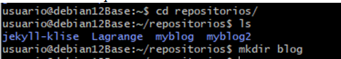
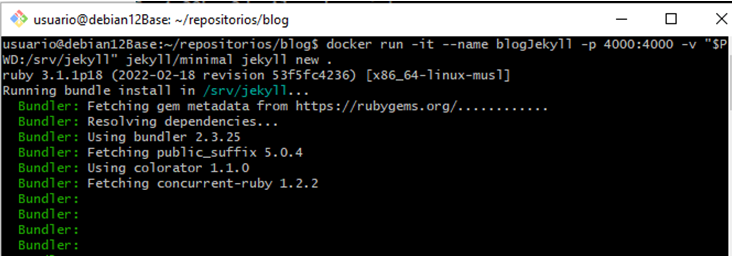
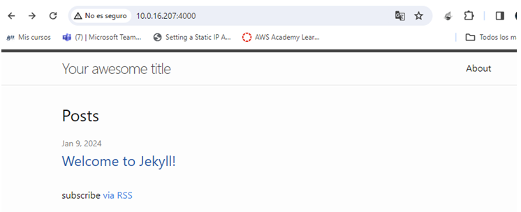

# Crear un sitio local en Jekyll usando Dockers

* ##  Direccion: http://10.0.16.207:4000
* ##  Ubicacion: home/usuario/repositorios/blog
 

Primero creo en  **local** el repositorio en el que se ubicará el sitio... 

Dentro de esta carpeta ejecutaré:

 `docker run -it --rm -v "$PWD:/srv/jekyll" jekyll/jekyll jekyll new .`

Ahora en **local** ya me sale al haber replicado la carpeta con la que jekyll usa dentro del contenedor. Esto es gracias a la opcion -v (bind mount)

Ahora usare build para que me cree la carpeta _site:

 `docker run -it --rm -v "$PWD:/srv/jekyll" jekyll/jekyll jekyll build`

### Antes de lanzar el servicio hay que realizar otro paso...
Nos va a dar error de una gema webrick. En **Gemfile** hay que añadir la línea:

_gem "webrick"_

Tras esto ejecutamos 

`docker run -it --rm -v "$PWD:/srv/jekyll" jekyll/jekyll bash -c "bundle install"`

Despues de este comando ya se puede lanzar:

`docker run -it --rm -p 4000:4000 -v "$PWD:/srv/jekyll" jekyll/jekyll jekyll serve --force_polling`

### RESULTADO

