# Crear sitio web basico con Jeckyll 

## Link al sitio
[Pincha aquí](https://mariocuee38.github.io/minima/)

Me he conectado por _ssh_ al server de debian

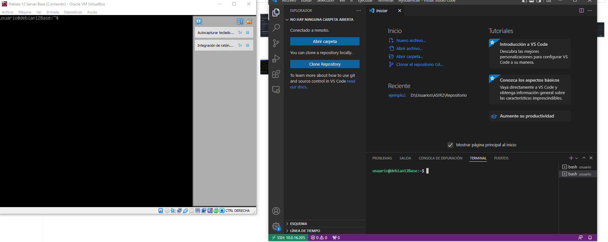

creo un directorio vacio en github:

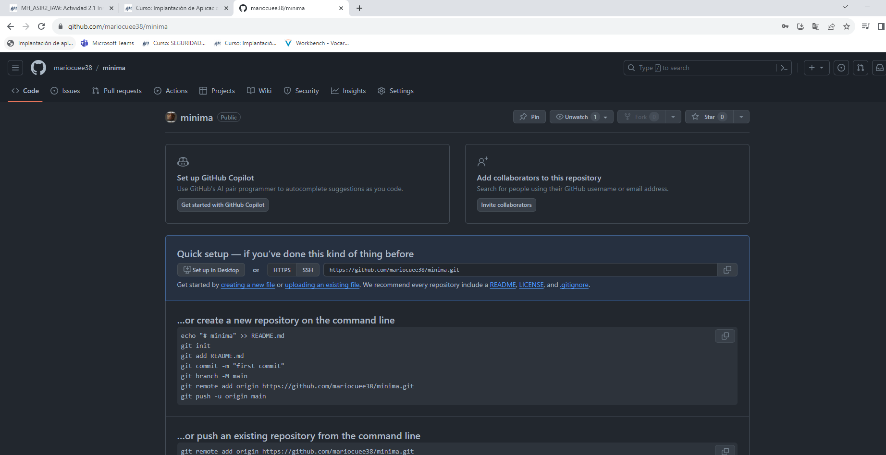

creo en local la estructura

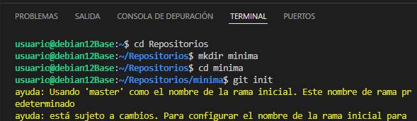

conecto al github

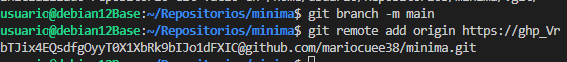

me cambio a la rama gh-pages y inicio el jeckyll

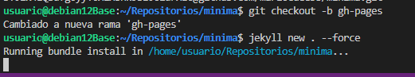

Ahora ya puedo desde el visual studio editar todo para añadir contenido:

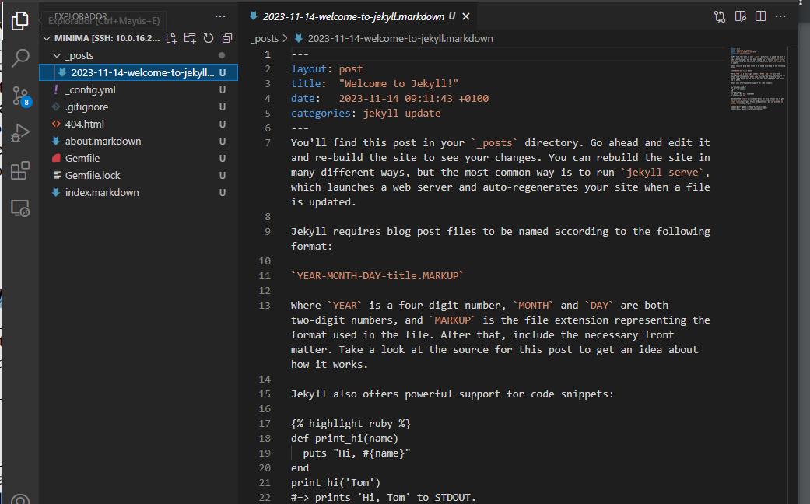

En config_yaml se pueden editar cosas como el autor, usuario de github...

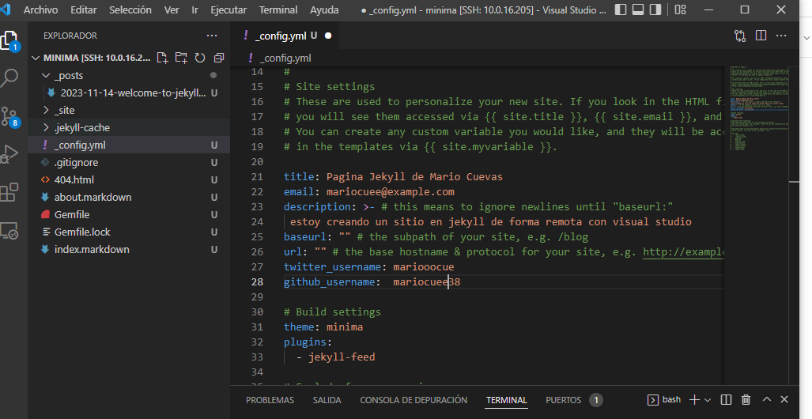

inicio el servicio para poder entrar desde el navegador:

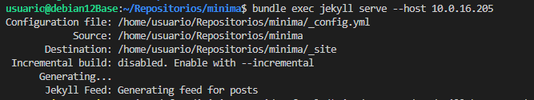

Esto es lo que me sale de momento:

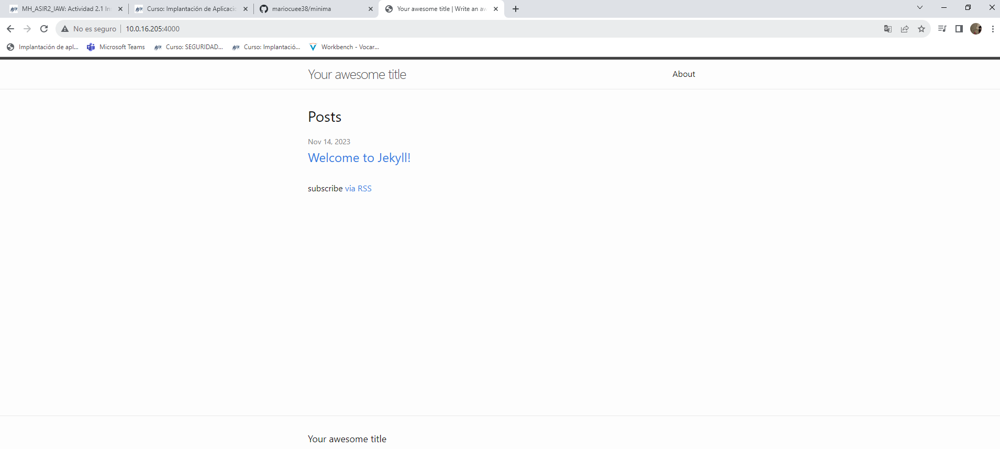

Aqui edito el index:

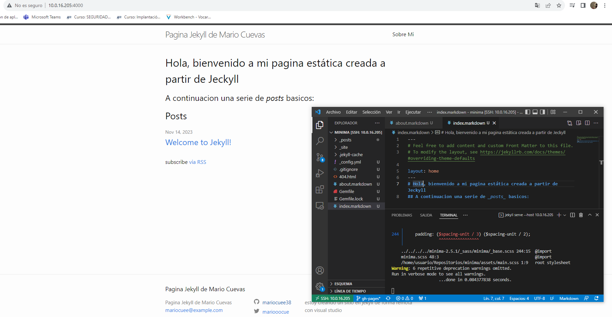

Aquí edito el about:

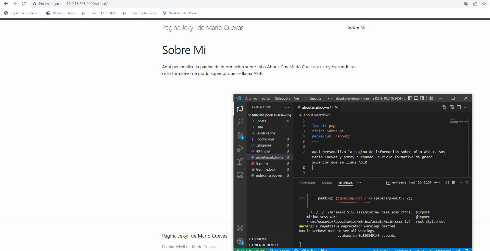

Creo otra pagina nueva...

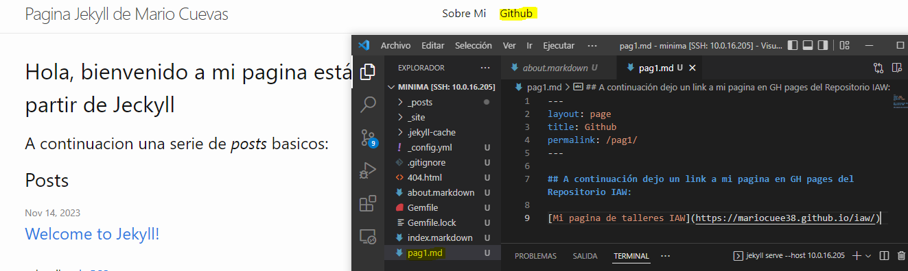

Quedaría asi:

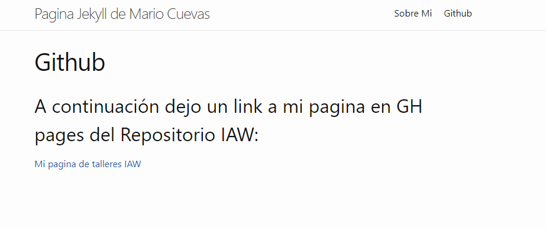

Ahora ya edito los posts:

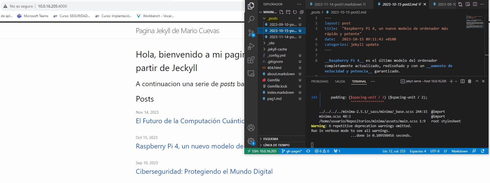

Me quedan de esta forma:

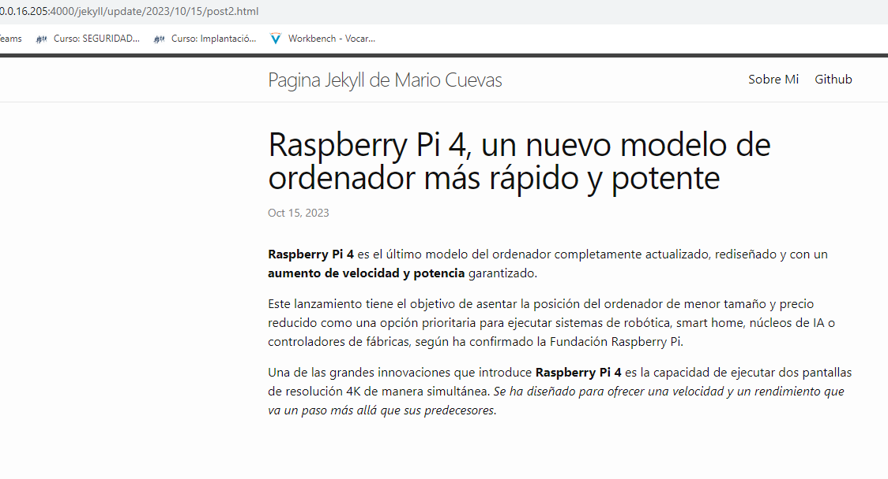

                                                                                                                                                                        Hecho por Mario Cuevas ASIR2